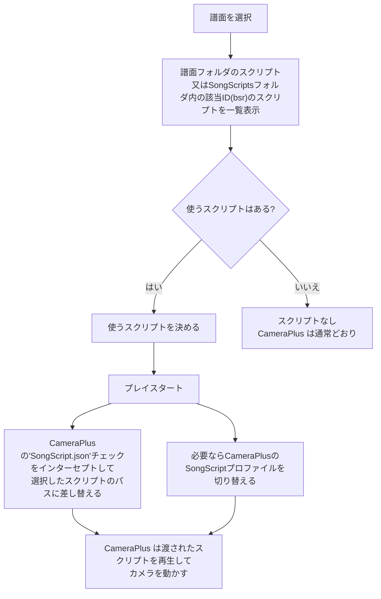
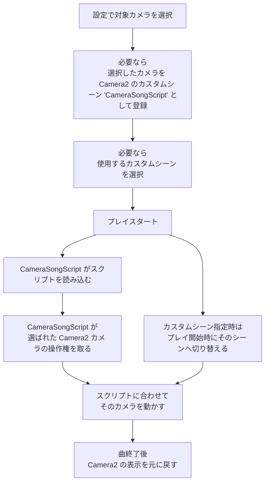

# CameraSongScript

Beat Saber のカメラ Mod である [Camera2](https://github.com/kinsi55/CS_BeatSaber_Camera2) / [CameraPlus](https://github.com/Snow1226/CameraPlus) に、高機能な曲別カメラスクリプト機能を追加する Mod です。

譜面フォルダ内のスクリプト、または `UserData/CameraSongScript/SongScripts` に置いたスクリプトを自動検出し、プレイ開始時にカメラへ適用します。さらに、汎用スクリプト、プレビュー再生、BetterSongListへのフィルタ・ソート追加、HttpSiraStatusで情報送信、未導入譜面の BeatSaver ダウンロードまでをひとまとめに扱えます。

## 主な機能

- Camera2 / CameraPlus 両対応で 曲専用のスクリプト を適用します
- 譜面フォルダ内の `.json` と、`SongScripts` フォルダ内の `.json` / `.zip` を自動スキャンします
- スクリプトJSONの `metadata.mapId` / `metadata.hash` に加え、ファイル名やフォルダ名先頭の 1〜6 桁の 16 進文字列からも `譜面ID(bsr)` を推定できます
- `CommonScripts` フォルダの汎用スクリプトを、曲専用が無い場合の代替または常時強制で利用できます
- 曲・難易度・Characteristic ごとに選択したスクリプトと、高さオフセット保存に対応しています
- メニュー上でスクリプトの 3D プレビュー再生、シーク、倍速再生、表示位置調整ができます
- `SongScripts` に含まれる `譜面ID(bsr)` のうち未導入譜面を BeatSaver からダウンロードできます
- BetterSongList に `SongScript` フィルタと `SongScript Order` ソートを追加できます
- HttpSiraStatus へ、実際に再生される SongScript / CommonScript の状態と metadata を送信できます
- ステータスパネルをメニュー空間に表示し、12 個のプリセット位置や細かな座標調整に対応しています
- UIとホバーヒントの言語は `Auto` / `English` / `Japanese` を切り替え可能です
- Camera2 で非対応な `CameraEffect` / `WindowControl` を含むスクリプトには警告を表示します
- 本体とアダプタのバージョン不整合がある場合は UI 上で警告を出します

## Mod構成

`CameraSongScript` は、以下の 5 個のModで構成されています。

| Mod | 役割 |
|------|------|
| `CameraSongScript.dll` | 本体。SongScript検出、UI、設定、汎用スクリプト、プレビュー、キャッシュ、BeatSaver ダウンロード、CameraMod自動判定 |
| `CameraSongScript.Cam2.dll` | Camera2 アダプタ。Camera2 SDK 経由でカメラ制御、カスタムシーン切り替え、プレビュー用マテリアル取得 |
| `CameraSongScript.CamPlus.dll` | CameraPlus アダプタ。CameraPlus へスクリプトパスを渡し、プロファイル切り替え、プレビュー用マテリアル取得 |
| `CameraSongScript.BetterSongList.dll` | BetterSongList 連携。スクリプトの有譜面のフィルタと、スクリプトパス名でのソートを追加 |
| `CameraSongScript.HttpSiraStatus.dll` | HttpSiraStatus 連携。プレイ開始時の SongScript 情報を外部へ送信 |

※各アダプタModは対象のModが存在しない場合はBSIPAによって読み込まれないため、基本的に使用Modに関わらず全てPluginsフォルダに置いてください。

## 必要環境

### 必須Mod

- BSIPA
- SiraUtil
- BeatSaberMarkupLanguage
- BeatSaverSharp
- SongCore
- SongDetailsCache
- Camera2 または CameraPlus のいずれか

#### 1.34.2以降
- System.IO.Compression
- System.IO.Compression.FileSystem

### 任意Mod

- BetterSongList
- HttpSiraStatus

## インストール

1. [リリースページ](https://github.com/rynan4818/CameraSongScript/releases)から ZIP をダウンロードします
2. ZIP を Beat Saber のルートフォルダへ展開します
3. 展開後、`Plugins/` 配下に以下の DLL が配置されます

```text
Plugins/CameraSongScript.dll
Plugins/CameraSongScript.Cam2.dll
Plugins/CameraSongScript.CamPlus.dll
Plugins/CameraSongScript.BetterSongList.dll
Plugins/CameraSongScript.HttpSiraStatus.dll
```

初回起動時、必要に応じて `UserData/CameraSongScript/SongScripts` と `UserData/CameraSongScript/CommonScripts` が自動生成されます。

## 使い方

### 1. 譜面フォルダに直接置く

譜面フォルダ内に任意の `.json` を配置すると、その譜面専用の SongScript として認識されます。`SongScript.json` 以外の名前でも構いません。複数あれば UI のドロップダウンから切り替えられます。

```text
Beat Saber/Beat Saber_Data/CustomLevels/[譜面フォルダ]/SongScript.json
Beat Saber/Beat Saber_Data/CustomWIPLevels/[譜面フォルダ]/AnyName.json
```

### 2. `SongScripts` フォルダに集約する

`UserData/CameraSongScript/SongScripts` には、サブフォルダ付きの `.json` と `.zip` を配置できます。ここに置いたスクリプトは以下の順で曲へマッチします。

ファイル名もしくはフォルダ名の先頭に譜面ID(bsr)が記載されたスクリプトをGoogleDriveなどで公開されている場合は、まとめてzipでダウンロードしたものを、そのまま `SongScripts`フォルダに置いて使えます。

- スクリプトJSON内の`metadata.mapId` ※譜面ID(bsr)
- スクリプトJSON内の`metadata.hash`  ※譜面ハッシュ(SHA-1)
- 以下の優先順での譜面ID(bsr)推定
    1. ファイル名先頭の 1〜6 桁の 16 進文字列
    2. ZIP 内親フォルダ名先頭の 1〜6 桁の 16 進文字列
    3. 配置元親フォルダ名先頭の 1〜6 桁の 16 進文字列

※JSONのmetadataとファイル・フォルダ名推定はOR条件なので、１つのスクリプトが異なる譜面に割当たることがあります

※大文字小文字は区別しません。

```text
Beat Saber/UserData/CameraSongScript/SongScripts/[任意のサブフォルダ]/script.json
Beat Saber/UserData/CameraSongScript/SongScripts/[任意のサブフォルダ]/script.zip
```

### 3. `CommonScripts` フォルダを使う

`UserData/CameraSongScript/CommonScripts` に置いた `.json` は、特定の曲に紐付かない汎用スクリプトとして扱われます。`SongScripts` と違って ZIP は読みません。

```text
Beat Saber/UserData/CameraSongScript/CommonScripts/[任意のサブフォルダ]/common.json
```

### 4. 基本的な使い方

1. 譜面選択メニュー左の MODS タブに `CAMERA SONG SCRIPT` が追加されます
2. 曲を選ぶとスクリプトがスキャンされ、検索結果・候補・metadata が表示されます
3. 必要ならスクリプト選択、オフセット調整、プレビュー確認を行います
4. プレイ開始時に、現在の Camera2 / CameraPlus 設定へスクリプトが適用されます

#### CameraPlusの場合

通常の譜面フォルダに置いた `SongScript.json` が動作する状態にしてください。

本ModからCameraPLusのLoad profile on scene change機能のSongScriptの設定を曲専用と汎用で切り替えることができます。

#### Camera2の場合

スクリプト再生用のカメラを作成してください。（全画面の三人称カメラなど）

スクリプトで動かす対象のカメラを選択して、


## CameraPlus と Camera2 への本Modの追加機能

### CameraPlus



### Camera2

CameraPlusのプレイスタート以降が異なります




## UI と設定

### `CAMERA SONG SCRIPT` タブ

#### 基本

- `Camera Mod`
  - 現在検出されているカメラ Mod を表示します
- `Enabled`
  - SongScript 機能の有効 / 無効を切り替えます
- ステータス表示
  - 現在の曲に SongScript があるか、CommonScript にフォールバックしたか、Camera2 非対応機能やアダプタ不整合の警告があるかを表示します
- `Script File`
  - 利用可能スクリプトの切り替えです。選択は `LevelID + Difficulty + Characteristic` 単位で保存されます
- metadata パネル
  - `cameraScriptAuthorName`、曲名、マッパー名、`avatarHeight`、説明文を表示します
- `Height Y Offset (cm)` / `Reset Offset`
  - スクリプト基準の高さを `-200cm` から `+200cm` の範囲で調整します

#### Preview

- `Show Start`
  - 現在選択中の SongScript / CommonScript のプレビューを表示して再生します
- `Stop`
  - プレビュー再生を停止します
- `Clear`
  - プレビュー表示を破棄します
- `Preview Position`
  - シークバーです
- `X2` / `X4` / `X8` / `X16`
  - 倍速再生です

#### Beatmap Script Management

- `Download Missing Beatmaps`
  - `SongScripts` 側の `mapId` を参照し、未インストール譜面を BeatSaver から取得します
- `Rerun SongScript Caches`
  - `SongScripts` フォルダキャッシュと BetterSongList 用の譜面キャッシュを再構築します

#### Camera2 使用時

- `Use Audio Sync`
  - 曲のタイムライン同期でスクリプトを進めます。OFF の場合はリアルタイム基準です
- `Target Camera`
  - `(All)` なら全アクティブカメラ、個別名なら指定カメラだけへ適用します
- `Custom Scene`
  - SongScript 検出時に切り替える Camera2 の Custom Scene を指定します
- `Add 'CameraSongScript' Custom Scene`
  - 選択中の Target Camera を `CameraSongScript` という名前の Custom Scene として登録 / 更新します
- `Refresh Camera2 Lists`
  - カメラ一覧と Custom Scene 一覧を更新します

#### CameraPlus 使用時

- `SongScript Profile`
  - SongScript 検出時に切り替える CameraPlus プロファイルを選択します
  - `(NoChange)` は変更なし、`(Delete)` は空文字へリセットです
- `Refresh CameraPlus Profiles`
  - プロファイル一覧を更新します

#### Common Script

- `Fallback to Common`
  - SongScript が見つからない曲で CommonScript を使用します
- `Force Common Script`
  - SongScript の有無や `Enabled` に関係なく CommonScript を強制します
- `Common Script`
  - `(Random)` または固定の CommonScript を選択します

Camera2 使用時は以下も表示されます。

- `CS Target Camera`
  - 空値なら SongScript 設定と同じカメラを使います
- `CS Custom Scene`
  - 空値なら SongScript 設定と同じ Custom Scene を使います

CameraPlus 使用時は以下も表示されます。

- `CS Profile`
  - 空値なら SongScript 設定と同じプロファイルを使います

#### Status Panel

- `Show Status Panel`
  - メニュー空間に SongScript 状態パネルを表示します
- `Shorten Status Panel Script Path`
  - ステータス上のスクリプトパス表示を短縮します
- `Panel Position`
  - `Left / Center / Right` × `UpperRight / UpperLeft / LowerRight / LowerLeft` の 12 プリセットから選びます
- 座標 / 回転調整ボタン
  - 現在のプリセット位置を `x/y/z` 単位で微調整します
- `Reset Status Panel Transform`
  - 現在選択中プリセットの座標・回転を既定値へ戻します

#### Preview Visual Settings

- `Preview Miniature Scale`
- `Preview Visible Position X/Y/Z`
- `Preview Path Line Width`
- `Preview Screen Scale`
- `Preview Screen Position Y`
- `Reset`

これらはプレビュー表示の見た目だけを調整します。

### MOD Settings メニュー

左メニューの歯車アイコン側には、以下のグローバル設定が追加されます。

- `Per-Script Height Offset`
  - ON でスクリプト単位、OFF で共通値として高さオフセットを保存します
- `Hover-Hint Language`
  - `Auto` / `English` / `Japanese`
- `Show Hover-Hints`
  - ホバーヒント表示の ON / OFF

## 設定ファイルと保存データ

| パス | 説明 |
|------|------|
| `UserData/CameraSongScript.json` | メイン設定ファイル |
| `UserData/CameraSongScript/CameraSongScript_SongSettings.json` | 曲ごとの選択スクリプトとスクリプト単位オフセットの保存先 |
| `UserData/CameraSongScript/SongScriptsFolderCache.json` | `SongScripts` フォルダのキャッシュ |
| `UserData/CameraSongScript/BeatmapSongScriptCache.json` | BetterSongList 用の譜面フォルダキャッシュ |
| `UserData/CameraSongScript/SongScripts/` | 曲別スクリプト配置フォルダ (設定で変更可能) |
| `UserData/CameraSongScript/CommonScripts/` | 汎用スクリプト配置フォルダ (設定で変更可能) |

## `CameraSongScript.json` を直接編集する主な項目

### UI に出ていない項目

| 項目 | デフォルト値 | 説明 |
|------|------|------|
| `PreviewStageLineWidth` | `0.012` | プレビューのステージ枠線の太さ |
| `CommonScriptsFolderPath` | `UserData\CameraSongScript\CommonScripts` | CommonScripts フォルダの配置先 |
| `SongScriptsFolderPath` | `UserData\CameraSongScript\SongScripts` | SongScripts フォルダの配置先 |

## BetterSongList / HttpSiraStatus 連携

### BetterSongList

`CameraSongScript.BetterSongList.dll` を導入すると、Custom Songs 画面に以下を追加します。

- フィルタ `SongScript`
  - SongScript を持つ譜面だけを絞り込めます
- ソート `SongScript Order`
  - `SongScripts` フォルダ起点のスクリプトを優先し、その後に譜面フォルダ内 SongScript を持つ譜面を並べます

BetterSongList 側でプラグイン製 Sort / Filter が拒否される設定になっていると登録できません。

### HttpSiraStatus

`CameraSongScript.HttpSiraStatus.dll` を導入すると、プレイ開始時に `OtherJSON["CameraSongScript"]` へ以下を送信します。

- `status`
  - `none`
  - `songScript`
  - `commonScript`
- `metadata`
  - `cameraScriptAuthorName`
  - `songName`
  - `songSubName`
  - `songAuthorName`
  - `levelAuthorName`
  - `mapId`
  - `hash`
  - `bpm`
  - `duration`
  - `avatarHeight`
  - `description`
  - `cameraHeightOffsetCm`
  - `scriptFileName`

## カメラスクリプト形式

CameraSongScript は CameraPlus の MovementScript 形式 JSON を読みます。Camera2 側では同じ JSON を解析して独自に再生し、CameraPlus 側では CameraPlus 本来の SongSpecificScript 機能へパスを渡します。

### 対応機能

| 機能 | Camera2 | CameraPlus |
|------|---------|------------|
| Position / Rotation 補間 | 対応 | CameraPlus 側で対応 |
| FOV | 対応 | CameraPlus 側で対応 |
| EaseTransition | 対応 | CameraPlus 側で対応 |
| TurnToHead | 対応 | CameraPlus 側で対応 |
| TurnToHeadHorizontal | 対応 | CameraPlus 側で対応 |
| VisibleObject | 対応 | CameraPlus 側で対応 |
| Duration / Delay | 対応 | CameraPlus 側で対応 |
| ループ再生 | 対応 | CameraPlus 側で対応 |
| ActiveInPauseMenu | 対応 | CameraPlus 側で対応 |
| metadata | 対応 | 対応 |
| CameraEffect | 非対応 | CameraPlus 側で対応 |
| WindowControl | 非対応 | CameraPlus 側で対応 |

Camera2 では `CameraEffect` と `WindowControl` を再生しません。該当フィールドを含むスクリプトを選ぶと、UI に警告が表示されます。

### JSON 例

```json
{
  "metadata": {
    "cameraScriptAuthorName": "作者名",
    "songName": "曲名",
    "levelAuthorName": "マッパー名",
    "mapId": "1234a",
    "hash": "0123456789abcdef0123456789abcdef01234567",
    "avatarHeight": 170.0,
    "description": "スクリプトの説明"
  },
  "ActiveInPauseMenu": "true",
  "Movements": [
    {
      "StartPos": { "x": "0", "y": "1.5", "z": "-3", "FOV": "90" },
      "StartRot": { "x": "15", "y": "0", "z": "0" },
      "EndPos": { "x": "2", "y": "2", "z": "-2", "FOV": "60" },
      "EndRot": { "x": "10", "y": "30", "z": "0" },
      "Duration": "5.0",
      "Delay": "1.0",
      "EaseTransition": "true",
      "TurnToHead": "false"
    }
  ],
}
```

### `metadata` フィールド

| フィールド | 説明 |
|-----------|------|
| `cameraScriptAuthorName` | カメラスクリプト作者名 |
| `songName` | 曲名 |
| `songSubName` | 曲サブ名 |
| `songAuthorName` | 曲アーティスト名 |
| `levelAuthorName` | マッパー名 |
| `mapId` | BeatSaver のマップ ID。`SongScripts` 側のマッチングに使用 |
| `hash` | 譜面ハッシュ。`SongScripts` 側のマッチングに使用 |
| `bpm` | BPM |
| `duration` | 曲の長さ |
| `avatarHeight` | スクリプト作成時の想定アバター身長 |
| `description` | スクリプト説明 |

## Camera2 と CameraPlus の動作差

### Camera2

CameraSongScript 本体が Camera2 SDK のトークンを使って Position / Rotation / FOV / VisibleObject を毎フレーム制御します。必要に応じて カスタムシーン の切り替えも行います。

### CameraPlus

CameraSongScript は CameraPlus に スクリプトのパスを引き渡し、実際の MovementScript 再生は CameraPlus 側の仕組みを使います。SongScript / CommonScript 用のプロファイル切り替えも CameraPlus 側設定へ反映します。

## 開発者向けメモ

- ソリューションファイルは `CameraSongScript.slnx` です
- すべてのプラグインプロジェクトは `.NET Framework 4.8` の旧形式 csproj です
- 参照 DLL は `..\..\Refs` が存在する場合そこを使い、なければ Beat Saber 実環境の DLL を参照する前提です
- `CameraSongScript.AdapterVersionCheck.targets` により、アダプタ側の `AssemblyVersion` と `manifest.json` の `dependsOn.CameraSongScript` / `gameVersion` / `BSIPA` / `SiraUtil` の整合性をビルド時に検証します
- `CameraSongScript.Package` の Release ビルドでは、本体と各アダプタをまとめた配布用 ZIP を `CameraSongScript/bin/Release/zip/` に再生成します

## ライセンス

このプラグインは MIT ライセンスで公開されています。

カメラスクリプト形式は [CameraPlus](https://github.com/Snow1226/CameraPlus) の MovementScript に準拠しています。CameraPlus 側のライセンスは以下を参照してください。

- https://github.com/Snow1226/CameraPlus/blob/master/LICENSE
